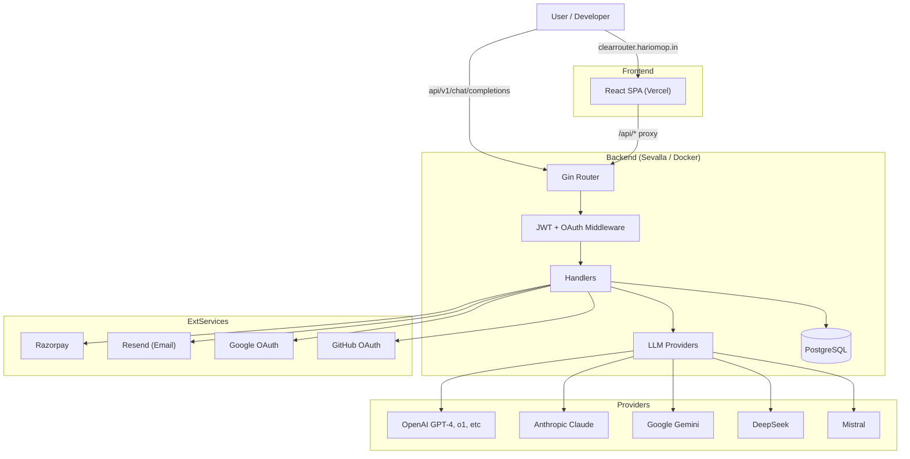
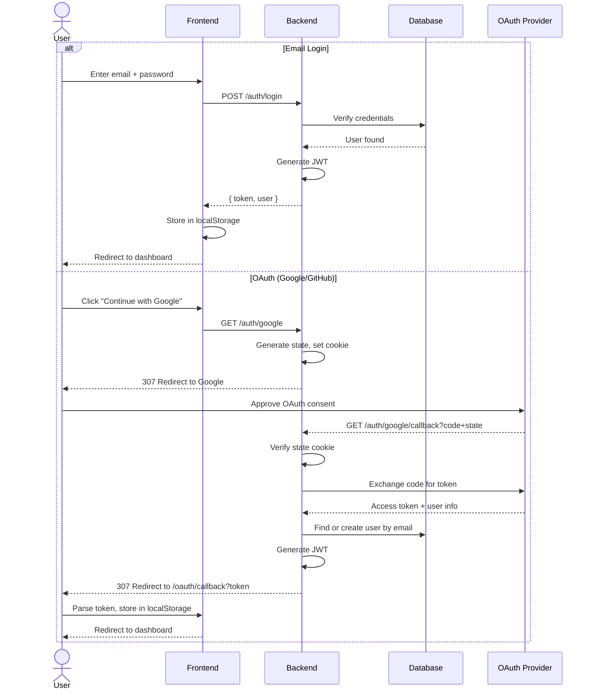
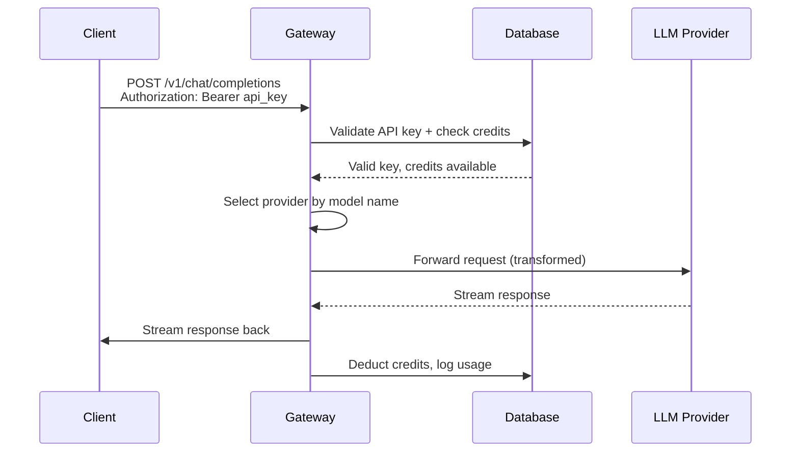

# ClearRouter

**One API to rule all LLMs.** ClearRouter is an AI API gateway that unifies 66+ models from OpenAI, Anthropic, Google, DeepSeek, and Mistral behind a single OpenAI-compatible endpoint. Built with credit-based billing, API key management, usage analytics, and a full dashboard.

```
User App → ClearRouter API → Any LLM Provider
```

---

## Architecture



---

## Features

### For Developers
- **Single API** — Send requests to one endpoint, route to any provider
- **OpenAI-compatible** — Use existing OpenAI SDKs, just change the base URL
- **API Key management** — Create, list, revoke keys from the dashboard
- **Chat history** — Persistent conversation history with search

### For Platform Owners
- **User authentication** — Email/password + Google/GitHub OAuth
- **Credit-based billing** — Pay-as-you-go via Razorpay
- **Usage analytics** — Track requests, tokens, and costs per user/key
- **Rate limiting** — Per-user rate limits for abuse prevention

### Supported Models

| Provider | Models |
|----------|--------|
| OpenAI | GPT-4, GPT-4o-mini, o1, o3-mini, and more |
| Anthropic | Claude 3.5 Sonnet, Claude 3 Opus, Claude 3 Haiku |
| Google | Gemini 2.5 Pro, Gemini 2.5 Flash, Gemini 2.0 Flash |
| DeepSeek | DeepSeek-V3, DeepSeek-R1 |
| Mistral | Mistral Large, Mistral Small, Codestral |

---

## Flow Diagrams

### Authentication Flow



### API Request Flow



---

## Tech Stack

| Layer | Technology |
|-------|-----------|
| Backend | Go + Gin + GORM |
| Database | PostgreSQL |
| Frontend | React 19 + TypeScript + Vite + Tailwind CSS |
| Auth | JWT + Google OAuth 2.0 + GitHub OAuth |
| Payments | Razorpay (orders, verification, webhooks) |
| Email | Resend (transactional emails) |
| CI/CD | GitHub Actions + Newman + Docker |
| Hosting | Vercel (frontend) + Sevalla (backend) |

---

## Quick Start

### Prerequisites
- Go 1.25+
- pnpm 9+
- Docker + Docker Compose
- PostgreSQL 15

### Local Development

```bash
# 1. Clone and install
git clone https://github.com/hariomop12/ClearRouter.git
cd ClearRouter
pnpm install

# 2. Copy env vars
cp .env .env.local   # Fill in your credentials

# 3. Start backend (Docker with Air hot-reload)
docker compose -f docker-compose.dev.yml up -d

# 4. Start frontend
cd apps/frontend && pnpm dev
```

- Backend: `http://localhost:8080`
- Frontend: `http://localhost:5173`

### Seed User
| Email | Password |
|-------|----------|
| admin@clearrouter.local | admin123 |

---

## API Reference

### Public Endpoints

| Method | Path | Description |
|--------|------|-------------|
| GET | `/health` | Health check |
| GET | `/models` | List all available models |
| POST | `/auth/signup` | Create account |
| POST | `/auth/login` | Login |
| POST | `/auth/signin` | Login alias |
| GET | `/auth/google` | Google OAuth login |
| GET | `/auth/github` | GitHub OAuth login |
| GET | `/auth/status` | OAuth provider config status |

### Protected (JWT required)

| Method | Path | Description |
|--------|------|-------------|
| PUT | `/user/username` | Update profile name |
| DELETE | `/user/account` | Delete account |
| POST | `/keys/create` | Create API key |
| GET | `/keys` | List API keys |
| DELETE | `/keys/:id` | Delete API key |
| POST | `/credits/order` | Create Razorpay payment order |
| POST | `/credits/verify` | Verify payment |
| GET | `/credits` | Get credit balance |
| POST | `/chat` | Dashboard chat (rate-limited) |
| POST | `/newchat` | Create chat session |
| GET | `/chathistory` | List chat sessions |
| GET | `/chathistory/:id` | Get chat details |
| DELETE | `/chathistory/:id` | Delete chat |
| GET | `/analytics/usage` | Usage statistics |
| GET | `/analytics/daily` | Daily usage summary |
| GET | `/analytics/detailed` | Detailed usage log |
| GET | `/analytics/costs` | Cost breakdown |

### API Key Access

```bash
curl -X POST https://clearrouter.hariomop.in/api/v1/chat/completions \
  -H "Authorization: Bearer YOUR_API_KEY" \
  -H "Content-Type: application/json" \
  -d '{
    "model": "gpt-4o-mini",
    "messages": [
      {"role": "user", "content": "Hello!"}
    ]
  }'
```

---

## Project Structure

```
ClearRouter/
├── apps/
│   ├── backend/                    # Go API server
│   │   ├── cmd/server/            # Entry point
│   │   ├── internal/
│   │   │   ├── handlers/          # HTTP handlers (auth, chat, credits, etc.)
│   │   │   ├── middleware/        # Auth & rate limiting middleware
│   │   │   ├── models/           # GORM models
│   │   │   ├── providers/        # LLM provider integrations
│   │   │   ├── services/         # Business logic
│   │   │   ├── utils/            # JWT, email, currency helpers
│   │   │   ├── dbmigrate/        # Schema migrations
│   │   │   └── seed/            # Default user seeder
│   │   ├── db/
│   │   │   ├── schema.sql        # Full PostgreSQL schema
│   │   │   └── migrations/       # dbmate migrations
│   │   └── Dockerfile.dev
│   └── frontend/                   # React SPA
│       ├── src/
│       │   ├── components/        # React components
│       │   ├── contexts/          # Auth context
│       │   └── services/          # API client
│       └── vercel.json           # Vercel proxy config
├── apis/                           # Postman collection + env
├── scripts/                        # Utility scripts
├── .github/workflows/              # CI/CD pipelines
├── Dockerfile                      # Production multi-stage build
├── docker-compose.yml              # Production compose
├── docker-compose.dev.yml          # Dev compose
└── AGENTS.md                       # AI agent instructions
```

---

## Environment Variables

See `.env.example` or `AGENTS.md` for full list. Required vars:

```
DATABASE_URL       # PostgreSQL connection string
JWT_SECRET         # JWT signing key
GOOGLE_CLIENT_ID   # Google OAuth client ID
GITHUB_CLIENT_ID   # GitHub OAuth client ID
RAZORPAY_KEY_ID    # Razorpay API key
RESEND_API_KEY     # Resend API key
OPENAI_API_KEY     # At least one LLM provider key
FRONTEND_URL       # Frontend URL for CORS
```

---

## License

MIT
