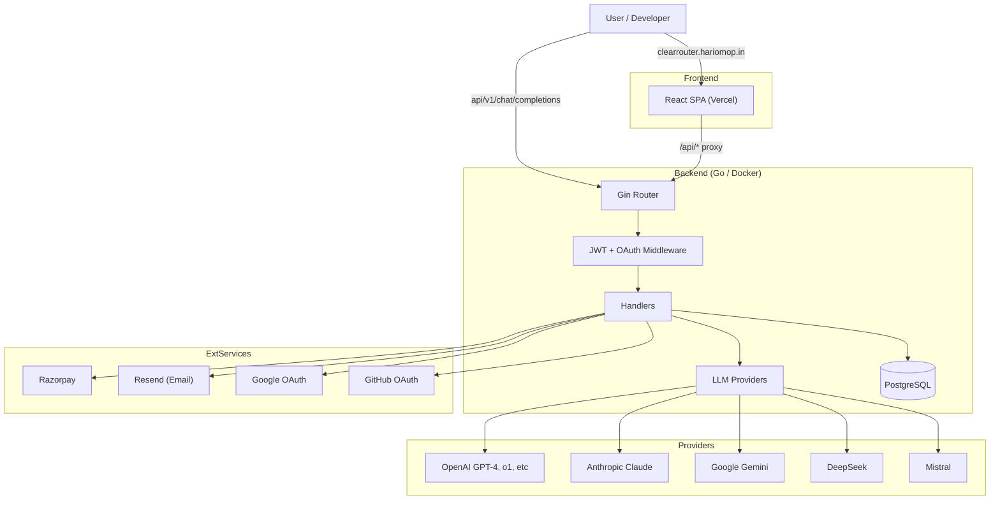
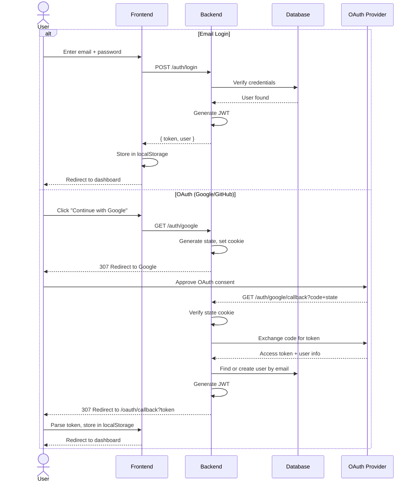
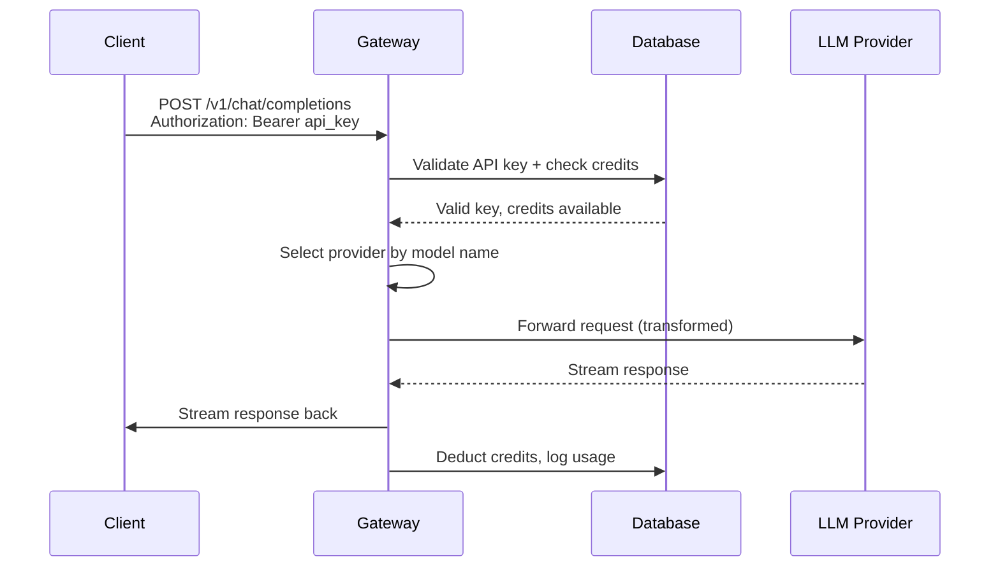

<div align="center">

# 🔀 ClearRouter

### One API to rule all LLMs — an AI Gateway built with Go

**Unify 66+ LLM models (OpenAI, Anthropic, Google, DeepSeek, Mistral) behind a single OpenAI-compatible endpoint** with API-key management, credit-based billing, usage analytics, and rate limiting.

[](https://go.dev)
[](https://github.com/gin-gonic/gin)
[](https://www.postgresql.org)
[](https://react.dev)
[](https://www.docker.com)
[](LICENSE)

**Live Demo:** [clearrouter.hariomop.in](https://clearrouter.hariomop.in) · **API:** [api.hariomop.in](https://api.hariomop.in)

```
User App ──▶ ClearRouter API ──▶ Any LLM Provider
```

</div>

---

## 📌 Highlights

- **Single OpenAI-compatible endpoint** (`/v1/chat/completions`) that routes to 66+ models across 5 providers — clients only change the base URL, no code changes
- **Credit-based billing** — pay-as-you-go with Razorpay orders, webhook verification, and atomic credit deduction
- **Multi-tenant API keys** — scoped key creation/revocation with per-key usage tracking and per-user analytics
- **Security-first auth** — JWT sessions + Google/GitHub OAuth 2.0 + email verification via Resend
- **Abuse protection** — per-user token-bucket rate limiting and per-request timeouts
- **Streaming responses** — forward provider streams straight back to the client
- **Full analytics dashboard** — requests, tokens, and cost breakdown per user/key

---

## 🏗 Architecture


```mermaid
graph TB
    subgraph Frontend
        React["React SPA (Vercel)"]
    end

    subgraph Backend ["Backend (Go / Docker)"]
        Gin["Gin Router"]
        Auth["JWT + OAuth Middleware"]
        Handler["Handlers"]
        Provider["LLM Providers"]
        DB[("PostgreSQL")]
        
        Gin --> Auth
        Auth --> Handler
        Handler --> Provider
        Handler --> DB
    end

    subgraph Providers
        OpenAI["OpenAI GPT-4, o1, etc"]
        Anthropic["Anthropic Claude"]
        Google["Google Gemini"]
        DeepSeek["DeepSeek"]
        Mistral["Mistral"]
    end

    subgraph ExtServices
        Razorpay["Razorpay"]
        Resend["Resend (Email)"]
        GoogleOAuth["Google OAuth"]
        GitHubOAuth["GitHub OAuth"]
    end

    User["User / Developer"] -->|"clearrouter.hariomop.in"| React
    User -->|"api/v1/chat/completions"| Gin
    React -->|"/api/* proxy"| Gin
    Provider --> OpenAI
    Provider --> Anthropic
    Provider --> Google
    Provider --> DeepSeek
    Provider --> Mistral
    Handler --> Razorpay
    Handler --> Resend
    Handler --> GoogleOAuth
    Handler --> GitHubOAuth
```

### Auth Flow


```mermaid
sequenceDiagram
    actor U as User
    participant F as Frontend
    participant B as Backend
    participant DB as Database
    participant O as OAuth Provider

    alt Email Login
        U->>F: Enter email + password
        F->>B: POST /auth/login
        B->>DB: Verify credentials
        DB-->>B: User found
        B->>B: Generate JWT
        B-->>F: { token, user }
        F->>F: Store in localStorage
        F-->>U: Redirect to dashboard
    else OAuth (Google/GitHub)
        U->>F: Click "Continue with Google"
        F->>B: GET /auth/google
        B->>B: Generate state, set cookie
        B-->>U: 307 Redirect to Google
        U->>O: Approve OAuth consent
        O-->>B: GET /auth/google/callback?code+state
        B->>B: Verify state cookie
        B->>O: Exchange code for token
        O-->>B: Access token + user info
        B->>DB: Find or create user by email
        B->>B: Generate JWT
        B-->>U: 307 Redirect to /oauth/callback?token
        U->>F: Parse token, store in localStorage
        F-->>U: Redirect to dashboard
    end
```

### Hosting Architecture

```
                        USERS (Browser/Phone)
                                 │
                    ┌────────────▼────────────┐
                    │       FRONTEND          │
                    │  React + Vite + TS      │
                    │   Hosted on: VERCEL     │
                    │  clearrouter.hariomop.in │
                    └────────────┬────────────┘
                                 │ /api/* reverse proxy
                                 ▼
                    ┌──────────────────────────┐
                    │   api.hariomop.in        │
                    │  BigRock DNS → A record  │
                    │      → 65.2.137.70       │
                    └────────────┬─────────────┘
                                 │ port 443 (HTTPS/SSL)
                                 ▼
                    ┌──────────────────────────┐
                    │       NGINX (EC2)        │
                    │  Let's Encrypt SSL cert  │
                    │  reverse proxy           │
                    └────────────┬─────────────┘
                                 │ proxy_pass → 127.0.0.1:8080
                                 ▼
                    ┌──────────────────────────┐
                    │    DOCKER CONTAINER      │
                    │    clearrouter-backend   │
                    │   Go + Gin (image from   │
                    │        GHCR)             │
                    └────────────┬─────────────┘
                                 │
              ┌──────────────────┼──────────────────┐
              ▼                  ▼                  ▼
        ┌──────────┐      ┌──────────────┐    ┌─────────────┐
        │ NEON     │      │ Google/GitHub │    │ Razorpay    │
        │ Postgres │      │ OAuth         │    │ payments    │
        │ (server- │      │ LLM APIs      │    │ webhooks    │
        │  less)   │      │ (OpenAI etc)  │    │             │
        └──────────┘      └──────────────┘    └─────────────┘
```

**Components:**

| Piece | Tech | Why |
|---|---|---|
| Frontend | Vercel (global CDN) | Free tier, git-push auto-deploy, auto-SSL on `clearrouter.hariomop.in` |
| Backend | AWS EC2 (single instance, `65.2.137.70`) | Dockerized Go service, only SSH (22) + HTTP (80) + HTTPS (443) open |
| Reverse proxy | nginx + Let's Encrypt | Terminates TLS, forwards to backend on `127.0.0.1:8080` (not exposed publicly) |
| Database | Neon (serverless PostgreSQL) | Managed, free tier, no self-hosting overhead |
| Container registry | GHCR (`ghcr.io/hariomop12/clearrouter-backend`) | Free, integrated with GitHub Actions |
| Auto-deploy | Watchtower | Polls GHCR every 60s, pulls new image, restarts container automatically |

### Deployment Pipeline (CI/CD)

```
git push → main
    │
    ▼
GitHub Actions (docker-publish.yml)
    │  1. Checkout repo
    │  2. Login to GHCR (GITHUB_TOKEN)
    │  3. Build multi-stage image (Dockerfile → target: prod)
    │  4. Push → ghcr.io/hariomop12/clearrouter-backend:latest
    │
    ▼
Watchtower on EC2 (every 60s)
    │  naya image mila?
    │    → pull → stop old container → recreate → remove old image
    │    → no change: nothing happens
    │
    ▼
clearrouter-backend container restarted with latest image
```

No manual SSH deploy needed — a push to `main` fully redeploys the backend automatically.

### DNS Records

| Host | Type | Target |
|---|---|---|
| `hariomop.in` | NS | `dns1-4.bigrock.in` (BigRock DNS) |
| `clearrouter.hariomop.in` | CNAME | Vercel |
| `api.hariomop.in` | A | `65.2.137.70` (EC2) |

### API Request Flow


```mermaid
sequenceDiagram
    participant C as Client
    participant B as Gateway
    participant DB as Database
    participant P as LLM Provider

    C->>B: POST /v1/chat/completions<br>Authorization: Bearer api_key
    B->>DB: Validate API key + check credits
    DB-->>B: Valid key, credits available
    B->>B: Select provider by model name
    B->>P: Forward request (transformed)
    P-->>B: Stream response
    B->>C: Stream response back
    B->>DB: Deduct credits, log usage
```

---

## ✨ Features

### For Developers
- **Single API** — one endpoint, any provider
- **OpenAI-compatible** — use existing OpenAI SDKs, just change the base URL
- **API Key management** — create, list, and revoke keys from the dashboard
- **Chat history** — persistent conversations with search

### For Platform Owners
- **User authentication** — email/password + Google/GitHub OAuth
- **Credit-based billing** — pay-as-you-go via Razorpay
- **Usage analytics** — requests, tokens, and costs per user/key
- **Rate limiting** — per-user token-bucket for abuse prevention

### Supported Models

| Provider | Models |
|----------|--------|
| OpenAI | GPT-4, GPT-4o-mini, o1, o3-mini, and more |
| Anthropic | Claude 3.5 Sonnet, Claude 3 Opus, Claude 3 Haiku |
| Google | Gemini 2.5 Pro, Gemini 2.5 Flash, Gemini 2.0 Flash |
| DeepSeek | DeepSeek-V3, DeepSeek-R1 |
| Mistral | Mistral Large, Mistral Small, Codestral |

---

## 🛠 Tech Stack

| Layer | Technology |
|-------|-----------|
| Backend | Go 1.25 + Gin + GORM |
| Database | PostgreSQL 15 (Neon) |
| Frontend | React 19 + TypeScript + Vite + Tailwind CSS |
| Auth | JWT + Google OAuth 2.0 + GitHub OAuth |
| Payments | Razorpay (orders, verification, webhooks) |
| Email | Resend (transactional emails) |
| CI/CD | GitHub Actions + Newman (Postman) + Docker + GHCR |
| Hosting | Vercel (frontend) + AWS EC2 (backend, nginx + Docker) |

---

## 🚀 Quick Start

### Prerequisites
- Go 1.25+, pnpm 9+, Docker, PostgreSQL 15

### Local Development

```bash
# 1. Clone and install
git clone https://github.com/hariomop12/ClearRouter.git
cd ClearRouter
pnpm install

# 2. Copy env vars
cp .env.example .env   # fill in your credentials

# 3. Start backend (Docker with Air hot-reload)
docker compose -f docker-compose.dev.yml up -d

# 4. Start frontend
cd apps/frontend && pnpm dev
```

- Backend: `http://localhost:8080`
- Frontend: `http://localhost:5173`

### Seed User
| Email | Password |
|-------|----------|
| admin@clearrouter.local | admin123 |

---

## 📚 API Reference

### Public Endpoints

| Method | Path | Description |
|--------|------|-------------|
| GET | `/health` | Health check |
| GET | `/models` | List all available models |
| POST | `/auth/signup` | Create account |
| POST | `/auth/login` | Login |
| GET | `/auth/google` | Google OAuth login |
| GET | `/auth/github` | GitHub OAuth login |
| GET | `/auth/status` | OAuth provider config status |

### Protected (JWT required)

| Method | Path | Description |
|--------|------|-------------|
| PUT | `/user/username` | Update profile name |
| DELETE | `/user/account` | Delete account |
| POST | `/keys/create` | Create API key |
| GET | `/keys` | List API keys |
| DELETE | `/keys/:id` | Delete API key |
| POST | `/credits/order` | Create Razorpay payment order |
| POST | `/credits/verify` | Verify payment |
| GET | `/credits` | Get credit balance |
| POST | `/chat` | Dashboard chat (rate-limited) |
| POST | `/newchat` | Create chat session |
| GET | `/chathistory` | List chat sessions |
| GET | `/chathistory/:id` | Get chat details |
| DELETE | `/chathistory/:id` | Delete chat |
| GET | `/analytics/usage` | Usage statistics |
| GET | `/analytics/daily` | Daily usage summary |
| GET | `/analytics/detailed` | Detailed usage log |
| GET | `/analytics/costs` | Cost breakdown |

### API Key Access (OpenAI-compatible)

```bash
curl -X POST https://api.hariomop.in/v1/chat/completions \
  -H "Authorization: Bearer YOUR_API_KEY" \
  -H "Content-Type: application/json" \
  -d '{
    "model": "gpt-4o-mini",
    "messages": [
      {"role": "user", "content": "Hello!"}
    ]
  }'
```

---

## 📁 Project Structure

```
ClearRouter/
├── apps/
│   ├── backend/                    # Go API server
│   │   ├── cmd/server/            # Entry point
│   │   ├── internal/
│   │   │   ├── handlers/          # HTTP handlers (auth, chat, credits, etc.)
│   │   │   ├── middleware/        # Auth & rate limiting middleware
│   │   │   ├── models/           # GORM models
│   │   │   ├── providers/        # LLM provider integrations
│   │   │   ├── services/         # Business logic
│   │   │   ├── utils/            # JWT, email, currency helpers
│   │   │   ├── dbmigrate/        # Schema migrations
│   │   │   └── seed/            # Default user seeder
│   │   ├── db/
│   │   │   ├── schema.sql        # Full PostgreSQL schema
│   │   │   └── migrations/       # dbmate migrations
│   │   └── Dockerfile.dev
│   └── frontend/                   # React SPA
│       ├── src/
│       │   ├── components/        # React components
│       │   ├── contexts/          # Auth context
│       │   └── services/          # API client
│       └── vercel.json           # Vercel proxy config
├── apis/                           # Postman collection + env
├── scripts/                        # Utility scripts
├── .github/workflows/              # CI/CD pipelines
├── Dockerfile                      # Multi-stage production build
├── docker-compose.yml              # Production compose
└── .env.example                    # Environment template
```

---

## 🔧 Environment Variables

| Variable | Description |
|----------|-------------|
| `DATABASE_URL` | PostgreSQL connection string |
| `JWT_SECRET` | JWT signing key |
| `GOOGLE_CLIENT_ID/SECRET` | Google OAuth app |
| `GITHUB_CLIENT_ID/SECRET` | GitHub OAuth app |
| `RAZORPAY_KEY_ID/SECRET` | Razorpay payments |
| `RESEND_API_KEY` | Transactional email |
| `OPENAI_API_KEY` (et al.) | LLM provider keys |
| `APP_URL` / `FRONTEND_URL` | Public URLs for CORS/links |
| `VITE_BACKEND_URL` | Frontend build-time backend URL |

---

## 🔬 What I Learned (Engineering Notes)

- **Go concurrency for rate limiting** — implemented a per-user token bucket (`golang.org/x/time/rate`) so abusive dashboard traffic can't exhaust credits
- **Provider abstraction** — a common `Provider` interface over OpenAI/Anthropic/Google/DeepSeek/Mistral request/response transforms, so adding a new model is a config change
- **Atomic money handling** — credit deductions and payment verification use DB transactions to avoid double-spend
- **Stateless JWT + OAuth state cookies** — CSRF-safe OAuth flow with `SameSite=Lax` + `Secure` cookies
- **Production hardening** — CORS allow-listing, per-endpoint rate limits, trusted-proxy config, release-mode Gin, Docker multi-stage builds

---

## License

MIT — see [LICENSE](LICENSE).
